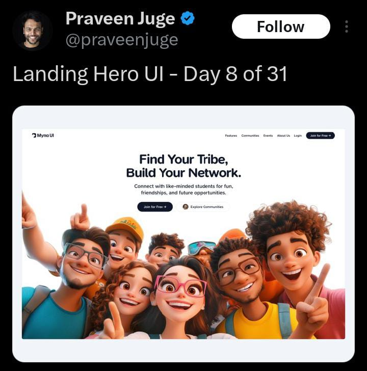
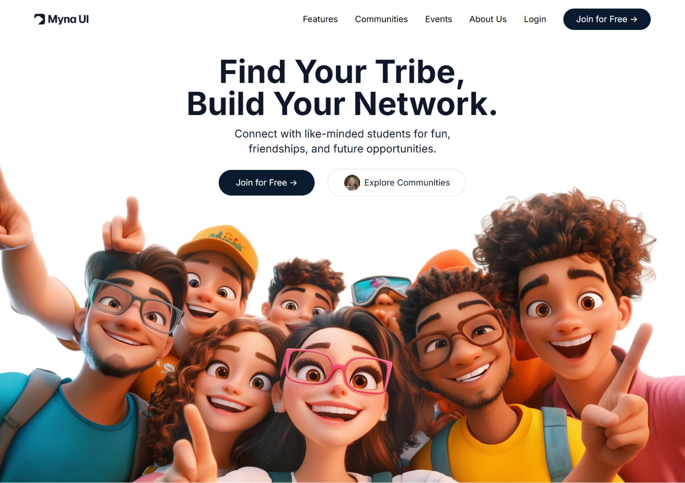
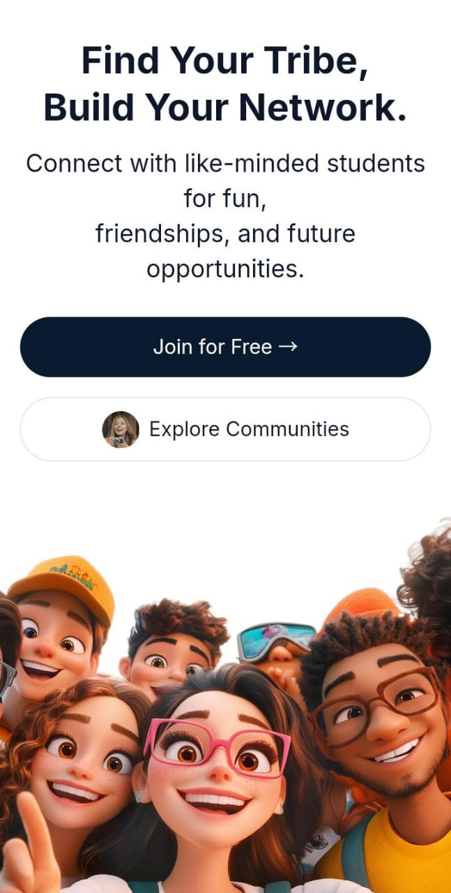

# Myng UI - A Twitter-Inspired Design Replication

This project is a replication of a design I saw on Twitter, built using **HTML**, **CSS (TailwindCSS)**, and a touch of interactivity. Below is a side-by-side comparison of the original design and my implementation:

## Design Comparison

| Original Twitter Design                      | My Replication                                |
| -------------------------------------------- | --------------------------------------------- |
|  |  |

## Features

- **Responsive Navbar**: Adaptable for desktop and mobile views.
- **Hero Section**: Includes a prominent headline, subtext, and call-to-action buttons.
- **Mobile Menu**: Smooth toggle functionality for navigation.
- **TailwindCSS Styling**: Clean and efficient utility-based styling.

## Technologies Used

- **HTML**
- **TailwindCSS**
- **JavaScript** (for menu toggle)

### Screenshots

Desktop View

Mobile View

